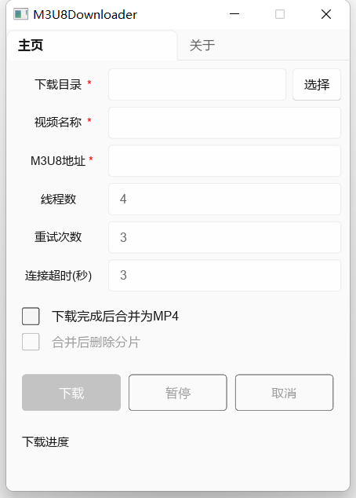

# M3U8Downloader
M3U8下载器，使用  `Rust` + `Slint UI` 实现。

## 已完成的功能

- 多线程并发下载
- 任务线程自动释放
- 实时显示下载进度
- 支持暂停和取消
- 可合并为MP4（确保已安装 `ffmpeg`）
- 合并后可删除分片
- 支持自定义线程数、重试次数和连接超时
- 使用默认主题（`fluent`）

## 下一步计划

- [ ] 自动选择最高分辨率下载（大师列表？）
- [ ] 自定义请求头

## 使用

二选一

- 克隆本项目手动构建
- 下载 `exe` 文件：[m3u8downloader-x86_64-v0.1.0.exe](http://124.71.107.97/res/m3u8downloader-x86_64-v0.1.0.exe)

## 截图

  
  

